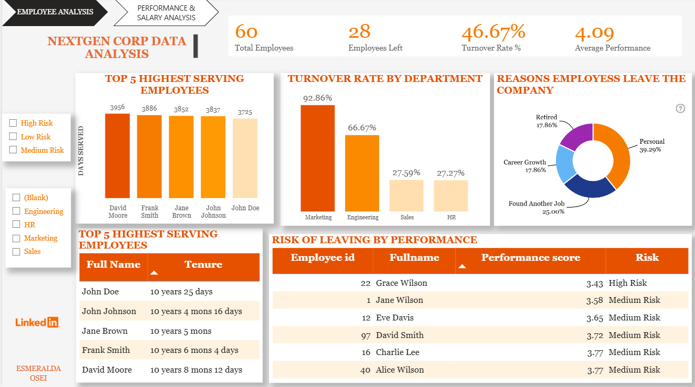

# 📊 NextGen Employee Retention Analysis

## 🧠 Project Overview

This project analyses employee retention trends to identify key factors contributing to staff turnover and predict employees at risk of leaving.

## 🎯 Objectives

* Identify departments with high turnover rates
* Analyse relationship between performance and attrition
* Highlight key reasons for employee exit
* Support data-driven HR decision making

## 🛠️ Tools & Technologies

* SQL (PostgreSQL)
* Power BI
* Excel

## 📊 Key Insights

* High turnover observed in specific departments with lower engagement
* Employees with lower performance scores showed higher risk of leaving
* Salary variation influenced retention in certain job roles
* Key exit reasons included career progression and job satisfaction

## 📸 Dashboard Preview

### 🔹 Overview Dashboard

### 🔹 Employee Analysis

### 🔹 Risk Analysis

## 💡 Recommendations

* Improve employee engagement strategies in high-risk departments
* Introduce targeted retention plans for at-risk employees
* Review salary structure for key roles
* Strengthen career development opportunities

## 📁 Project Files

* SQL queries used for analysis
* Power BI dashboard
* Supporting datasets

## 🔗 Let’s Connect

I’m open to feedback and collaboration opportunities in data analytics.

